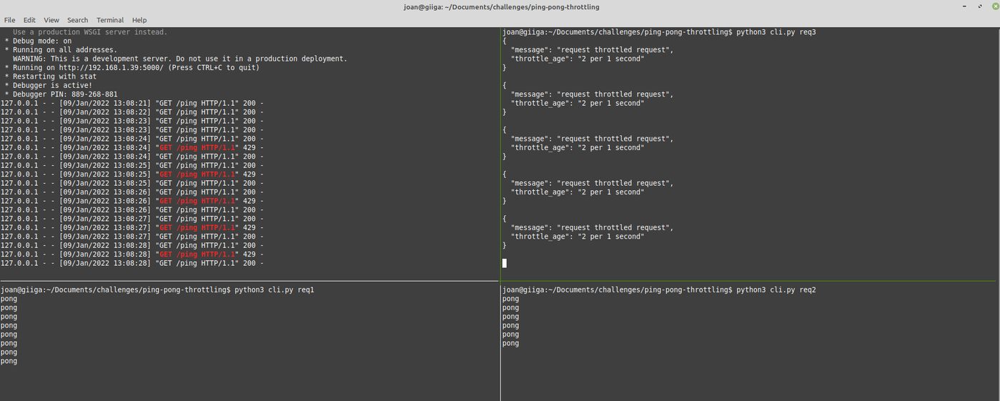

# Start the application with Docker only

Building the image and creating a tag. 
```
- docker build -t flask:v1 .
```
Running the docker container 
```
- docker run -d -p 5000:5000 --network="host" --name flask flask:v1
```

Checking logs from the docker container 
```
- docker logs -f flask
```

Starting CLI tool 
```
- python3 cli.py argument1(type the arugment that you want to use)
```

#################################################################################

# Deploying our app in a Kubernetes cluster with kind

If you have already builed the image you don't need to do it again
Building our Dockerfile
```
- docker build -t flask:v1 . 
```

Enter in the kubernetes folder 

Execute the start-cluster-linux or the start-cluster-mac-os in order to install the dependencies and create the cluster
- kind
- kubectl


You can check if your cluster was created
```
- kind get clusters
```

Loading our local docker image into the cluster 
```
- kind --name cluster-kubernertes load docker-image flask-app:v1
```

Deploying our application with the deployment type
```
- kubectl apply -f deployment.yaml
```

Checking that the deployments and the pods were created successfully 
```
- kubectl get deployments -o wide
- kubectl get pods -o wide
```

Forwarding the deployment in order to connect into our flask app
```
- kubectl port-forward deployment/flask-deployment 5000:5000
```

If you want to check the logs from the pods
```
- kubectl logs -f name_of_the_pod
```

Now you can use the CLI tool
```
- python3 cli.py argument1(type the arugment that you want to use)
```

Delete the cluster 
```
- kind delete cluster --name cluster-kubernertes
```


# Recommendations for a Kubernetes cluster

- To have an optimal cluster(in prod) we should at least have two master nodes in order to achieve High availability
- Use Deployments instead of naked Pods in order to achieve HA
- Create a Service, in this demo I used port-forwarding but you shouldn't use that. Probably the best option will be Ingress or a Load Balancer 
- Use labels to organize your cluster 
- Your pods should have a limit for their CPU and Memory
- Get the metrics from the cluster using tools like Prometheus and create dashboards with Grafana for example 

